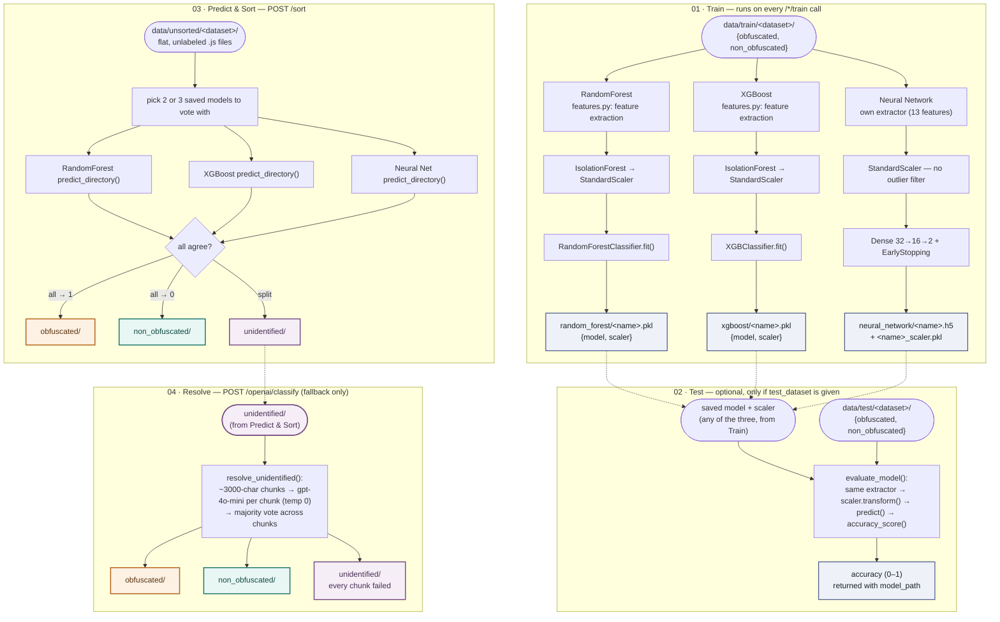

# Pipeline

How [detection/](detection/) moves a batch of JavaScript files from labeled training data to a final
**Obfuscated** / **NonObfuscated** call — across three independently trained models, an agreement vote,
and an OpenAI fallback for whatever the vote can't settle.

## How the stages connect

1. RandomForest and XGBoost share one feature extractor and outlier filter (`detection/features.py`).
   The neural network keeps its own separate 13-feature extractor and skips outlier filtering — it
   trains on every row as given.
2. `features.py`'s `is_only_code_blocks()` check runs ahead of RandomForest and XGBoost's features: a
   file that's structurally just JSON/object data is forced to NonObfuscated — regardless of which
   training folder it came from, or what the model would have guessed.
3. Test and Predict always re-run the exact same feature extractor and the exact same saved scaler used
   at Train time — a model is only ever scored or asked to vote on features built the same way it
   learned them.
4. `/sort` only writes to `obfuscated/` or `non_obfuscated/` when every selected model agrees. Any split
   vote — and only a split vote — lands in `unidentified/`, which is the sole input `/openai/classify`
   ever reads.

See [README.md](README.md) for setup, endpoints, and dataset layout.
